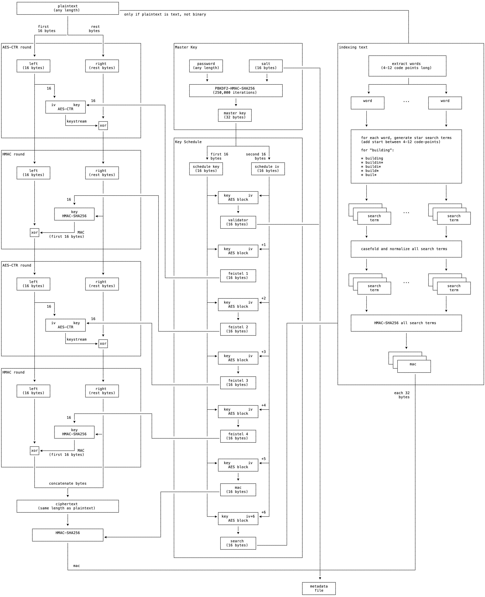

# Project: File Encryption

## Due Date
May 9th.  NO EXTENSIONS will be granted.

Gradescope submissions will not be immediately available. We will send an announcement when submissions are available.

Additionally, by March 2nd, we will provide a C binary as a reference that you can use to help you make sure to get the functionality right.

## Overview
In this project, you will be building a program that:

1) Can encrypt or decrypt individual files, using a password.
2) Can allow you to search for key words in encrypted files.

In order to do this, you will use the following concepts, mostly from class:

1) You will use a password-based key derivation function to generate a "master" key.
2) You will use a simpler KDF scheme to generate a series of keys for further operations.
3) You will use two different PRFs to implement a four-round feistel cipher that you will use for encryption and decryption.
4) You will use HMAC-SHA2-256 in order to detect attempts to tamper with files.
5) You will use HMAC-SHA2-256 in order to support encrypted search terms.

## Basic command-line operation

- You will supply an executable called 'fencrypt'.

- Your file will take command line arguments.

- If no flags are provided, your program will encrypt. It must accept a -d flag to specify decryption. You may optionally accept an -e flag for encryption, and should not allow both flags to appear in the same command line.

- Your program will also need to accept an -s flag for search, which also may not appear with other flags.  When -s is provided, any further arguments will be interpreted as search terms.

- Your program will accept a -j flag, which will cause you to output JSON to stdout, per the description below.

- After any command-line flags are provided, if the operation is either encryption or decryption, then the remainder of the arguments shall be interpreted as files to operate upon.

- If any of the provided file names cannot be found on the file system, then you should give an appropriate error, and do NO operations.

- You will encrypt and decrypt files in-place.

- For any file named (generically) F you operate on, you will also create a file named '.fenc-meta.F', which will contain a single JSON object with state information about the file.

- If any file is smaller than 32 bytes, you should give an error message, and fail to operate on any files.

- Your program must properly encrypt and decrypt both binary and text files.  Searching will only be supported on valid UTF-8 encoded files.

- If any file in the list has already been encrypted (as evidenced by the contents of its metadata file), you should give an error, and perform NO operation.

- Once command-line arguments are passed, you will prompt the user for a password.  See the following section.

With the exeception of argument parsing errors, all errors must be output to stderr. Once argument parsing is done, you may only write to stdout to output JSON when the -j flag is provided, or when the -s flag is given, and you provide search outputs (see below).  With argument parsing you may only give error output when the specification for flags in this document is not met, and such errors can go to either stdout or stderr (allowing you to get parsing help from third party libraries).

You may add your own flags if you want; we will ignore them in grading. (For instance, you might consider adding an '-r' flag to support recursive operations).

## Reading Passwords

For every operation, you will need to read a password from standard input. You will apply this password as an input to the key generation function.

### Important

Make sure that the password is NOT echoed to the terminal.

## Key Generation

For each file to be encrypted, you will need to generate a "master" key from a password, and you will need to generate a number of sub-keys from the master key.

For the master key, even though the professor typically recommends Balloon Hashing, we will be using PBKDF2, because implementations are widely available (for instance, in Python's hashlib).  When using PBKDF2:

- You will use HMAC-SHA2-256 as the PRF.

- When encrypting, your salt will be 16 randomly generated bytes from   a secure random number generator.  This will be unique on a per-encryption basis, and stored in the per-file metadata.  Meaning, if you encrypt, decrypt, and re-encrypt, the second re-encryption will cause you to generate a new nonce for this operation.

- When decrypting or searching, you will use the salt from the encryption metadata.

- You will run PBKDF2 for exactly 250,000 iterations.

- You will generate a 32 byte output value.

You will then use the 32-byte output to generate a series of key material.  The first 16 bytes of output will be used to key AES in counter mode.  The second 16 bytes will be used as the initial counter block. Note that, some implementations of counter mode want only an eight byte nonce, and start the second eight bytes zeroed out.  You will not do this-- the initial value of the counter block should be the full 16 bytes.

You will then use counter mode to generate a series of 16 byte values:

- AES(Master_key, IV) : a password validator (see below).
- AES(Master_key, IV + 1) : the first round key in the Feistel Cipher
- AES(Master_key, IV + 2) : the second round key in the Feistel Cipher
- AES(Master_key, IV + 3) : the third round key in the Feistel Cipher
- AES(Master_key, IV + 4) : the fourth round key in the Feistel Cipher
- AES(Master_key, IV + 5) : the MAC key.
- AES(Master_key, IV + 6) : the key used for encrypting search terms.

While each invocation of your program may need to operate on multiple files (and generate new keys for each file), you will be able to operate on those files in any order.

Note that, if you need to build your own counter mode on top of ECB to get the bytes right, it will be important to handle the "add one" operation properly. You need to handle the carry correct when a byte overflows... it may cascade up.  Expect us to test to make sure you're doing this right.  Also, you will need to treat bytes in Big Endian format when you do this, meaning you are best off operating on a byte-by-byte basis.

### Important

If (and only if) the -j flag is provided, then you must output to stdout a JSON object containing as keys the filenames you're operating on, and as values, the hex-encoded 32-byte output of PBKDF2 associated with each file.  We will specify for each operation, at which point to output data, if -j is provided.

## The Feistel Cipher
You will be implementing a simple, non-maleable encryption scheme using a four-round, unbalanced Feistel Network.  This will allow you to take files of any length, and produce an encrypted file of the exact same length.

For our scheme, we will consider the "left" side to be the first 16 bytes of an input, and the "right" side to be the remaining bytes.

When encrypting, the PRF for rounds 1 and 3 will be CTR mode, where the initial input to CTR-mode (the initial counter) is the 16 bytes in the left side.  In these rounds, generate a keystream, and XOR it with the right side.

The PRF for rounds 2 and 4 will be HMAC.  HMAC the right side, and XOR first 16 bytes of the MAC with the left side.

You will use the round keys generated by the KDF function, as specified above.

Decryption should be the appropriate inverse operation.

#### AES-CTR Round

```
┌──────────────────────────────────────────────────────────────┐
│AES-CTR round                                                 │
│                                                              │
│                                                              │
│      ┌──────────────┐               ┌──────────────┐         │
│      │     left     │               │    right     │         │
│      │  (16 bytes)  │               │ (rest bytes) │         │
│      └──────────────┘               └──────────────┘         │
│              │                 k(i)         │                │
│              │                              │                │
│              ├────────┐         │           │                │
│              │        │         │           │                │
│              │        │         │           │                │
│              │        ▼         ▼           │                │
│              │    ┌─────────────────┐       │                │
│              │    │  iv        key  │       │                │
│              │    │     AES-CTR     │       │                │
│              │    └─────────────────┘       │                │
│              │             │                ▼                │
│              │             │keystream     ┌───┐              │
│              │             └─────────────▶│xor│              │
│              │                            └───┘              │
│              │                              │                │
│              │                              │                │
│              ▼                              ▼                │
│         this is NOT                      this has            │
│       "scrambled" in                   "scrambled"           │
│           any way                       right side           │
│                                                              │
│                                                              │
└──────────────────────────────────────────────────────────────┘
```

#### HMAC Round

```
┌──────────────────────────────────────────────────────────────┐
│HMAC round                                                    │
│                                                              │
│                                                              │
│      ┌──────────────┐               ┌──────────────┐         │
│      │     left     │               │    right     │         │
│      │  (16 bytes)  │               │ (rest bytes) │         │
│      └──────────────┘               └──────────────┘         │
│              │                k(i)          │                │
│              │                              │                │
│              │                 │            │                │
│              │                 │            │                │
│              │                 │            │                │
│              │                 ▼            │                │
│              │        ┌─────────────────┐   │                │
│              │        │       key       │   │                │
│              │        │   HMAC-SHA256   │◀──┤                │
│              │        └─────────────────┘   │                │
│              ▼                 │            │                │
│            ┌───┐           MAC │            │                │
│            │xor│◀──────────────┘            │                │
│            └───┘                            │                │
│              │                              │                │
│              │                              │                │
│              ▼                              ▼                │
│          this has                      this is NOT           │
│         "scrambled"                  "scrambled" in          │
│          left side                       any way             │
│                                                              │
│                                                              │
└──────────────────────────────────────────────────────────────┘
```

## The MAC
Use HMAC-SHA2-256 and your MAC key to MAC the **ciphertext**. This will allow you to determine tampering without having to pay the price of a decryption operation.

## Search Terms

When encrypting, you will index files, and use HMAC-SHA2-256 with the final derived key to MAC search terms.

You will only collect search terms for files that are properly UTF-8 encoded. We will do a reasonable, but not perfect, job of breaking a UTF-8 string into words.  This is the approach taken by many regular expression libraries that will split on words:

* You will treat words as contiguous sequences of Unicode letters (character classes Lu, Ll, Lt, Lm, Lo), non-spacing marks (class Mn), decimel digits (Nd) and connector punctuation (Pc).

* Anything else (Punction, Symbols, Separators, and Other characters) can only separate words, not be part of them.

* You will index all words that have 4-12 codepoints, before casefolding and normalization.

* You will casefold words to lowercase, using the Unicode casefold algorithm.

* After casefolding, you will normalize unicode strings before generating search terms, using the NFC normalization form.

* After normalization, you will create encrypted full-match search terms by MACing them.

* You will also support asterisk matches by MACing all the search terms for each letter length from 4-12 codepoints.

* You will remove duplicates from your encrypted search terms, and will sort them in ascending order, based on the raw binary data.

### Important

Figuring out how to break up UTF-8 into words might sound challenging, but most languages and libraries that have Unicode capabilities will have a capability to extract words (or at least find word boundaries). Just use that!

Similarly, libraries and languages will have casefolding and normalization capabilities.

## Encryption

When the user specifies encryption, take the following actions:

1. Check to see that the files being encrypted exist, and are not already encrypted. Bail if there are any errors at this point.

2. Read the password from the user.

3. Generate the master key.

4. If the -j flag was specified, output the requested data, before transforming files.

5. Transform each file to be encrypted into a binary, encrypted file of exactly the same size as the input.

6. Output a metadata file, with the file name as specified above.  The contents of the metadata file should be a single JSON object with the following fields:

      - salt: Set to the 16 byte salt last used to encrypt this file. Hex-encode the nonce to make it acceptable to be in a JSON string.

      - validator: Set to the 16 byte validator generated from the password/salt combination, hex-encoded.

      - mac: Set to the 32 byte MAC output, generated from running HMAC-SHA2-256 with the appropriate round key, over the ciphertext.

      - terms: Set to a JSON list with ALL of the encryption search terms, hex encoded.

   You must add no other fields to the JSON, and you must not write to any other files on the file system during encryption.

### Diagram :allthethings:

<details>
<summary>ascii art 😀</summary>

```
       ┌─────────────────────────────────────────────┐
       │                  plaintext                  │
       │                (any length)                 │──────────────────────────────────────────────────────────────────────────────────────────────────────────────────────────────────┐
       └─────────────────────────────────────────────┘  only if plaintext is text, not binary                                                                                           │
                              │                                                                                                                                                         │
                              │                                                                                                                                                         │
                 first        │          rest                                                                                                                                           │
                 16 bytes     │         bytes                                                                                                                                           │
               ┌──────────────└───────────────┐                                                                                                                                         │
               │                              │                                                                                                                                         │
┌──────────────│──────────────────────────────│────────────────┐              ┌─────────────────────────────────────────────────────────┐               ┌───────────────────────────────┴─────────────────────────────────┐
│AES-CTR round │                              │                │              │Master Key                                               │               │indexing text                                                    │
│              │                              │                │              │                                                         │               │                                                                 │
│              ▼                              ▼                │              │                                                         │               │             ┌──────────────────────────────────┐                │
│      ┌──────────────┐               ┌──────────────┐         │              │      ┌──────────────┐           ┌──────────────┐        │               │             │                                  │                │
│      │     left     │               │    right     │         │              │      │   password   │           │     salt     │        │               │             │          extract words           │                │
│      │  (16 bytes)  │               │ (rest bytes) │         │              │      │ (any length) │           │  (16 bytes)  │────────────────┐       │             │     (4-12 code points long)      │                │
│      └──────────────┘               └──────────────┘         │              │      └──────────────┘           └──────────────┘        │       │       │             │                                  │                │
│              │                              │                │              │              │                          │               │       │       │             └──────────────────────────────────┘                │
│              │                              │                │              │              ▼                          ▼               │       │       │                               │                                 │
│              ├────────┐                     │                │              │      ┌─────────────────────────────────────────┐        │       │       │             ┌─────────────────┴────────────────┐                │
│              │     16 │                     │                │              │      │           PBKDF2-HMAC-SHA256            │        │       │       │             │                                  │                │
│              │        │                     │                │              │      │          (250,000 iterations)           │        │       │       │             ▼                                  ▼                │
│              │        ▼                     │                │              │      └─────────────────────────────────────────┘        │       │       │     ┌──────────────┐                   ┌──────────────┐         │
│              │    ┌─────────────────┐  16   │                │              │                           │                             │       │       │     │     word     │        ...        │     word     │         │
│              │    │  iv        key  │◀──────────────────────────────────┐   │                           ▼                             │       │       │     │              │                   │              │         │
│              │    │     AES-CTR     │       │                │          │   │                   ┌──────────────┐                      │       │       │     └──────────────┘                   └──────────────┘         │
│              │    └─────────────────┘       │                │          │   │                   │  master key  │                      │       │       │            │                                   │                │
│              │             │                ▼                │          │   │                   │  (32 bytes)  │                      │       │       │            │                                   │                │
│              │             │keystream     ┌───┐              │          │   │                   └──────────────┘                      │       │       │            │                                   │                │
│              │             └─────────────▶│xor│              │          │   │                           │                             │       │       │            ▼                                   ▼                │
│              │                            └───┘              │          │   └───────────────────────────┼─────────────────────────────┘       │       │     ┌─────────────────────────────────────────────────┐         │
│              │                              │                │          │                               │                                     │       │     │                                                 │         │
└──────────────┼──────────────────────────────┼────────────────┘          │   ┌───────────────────────────┼─────────────────────────────┐       │       │     │    for each word, generate star search terms    │         │
               │                              │                           │   │Key Schedule               │                             │       │       │     │    (add start between 4-12 code-points)         │         │
               │                              │                           │   │              ┌────────────┴──────────────┐              │       │       │     │                                                 │         │
┌──────────────┼──────────────────────────────┼────────────────┐          │   │              │                           │              │       │       │     │    for "building":                              │         │
│HMAC round    │                              │                │          │   │              │ first 16        second 16 │              │       │       │     │                                                 │         │
│              │                              │                │          │   │              ▼ bytes               bytes ▼              │       │       │     │    * building                                   │         │
│              ▼                              ▼                │          │   │      ┌──────────────┐            ┌──────────────┐       │       │       │     │    * buildin*                                   │         │
│      ┌──────────────┐               ┌──────────────┐         │          │   │      │ schedule key │            │ schedule iv  │       │       │       │     │    * buildi*                                    │         │
│      │     left     │               │    right     │         │          │   │      │  (16 bytes)  │            │  (16 bytes)  │       │       │       │     │    * build*                                     │         │
│      │  (16 bytes)  │               │ (rest bytes) │         │          │   │      └──────────────┘            └──────────────┘       │       │       │     │    * buil*                                      │         │
│      └──────────────┘               └──────────────┘         │          │   │              │                           │              │       │       │     │                                                 │         │
│              │                              │                │          │   │              │                           │              │       │       │     └─────────────────────────────────────────────────┘         │
│              │                              │                │          │   │              │                           │              │       │       │            │                                   │                │
│              │                              │                │          │   │              │    ┌─────────────────┐    │              │       │       │            │                                   │                │
│              │                 ┌─────────────────────────────────────┐  │   │              ├───▶│  key        iv  │◀───┤              │       │       │            │                                   │                │
│              │              16 │            │                │       │  │   │              │    │    AES block    │    │              │       │       │            ▼                                   ▼                │
│              │                 ▼            │                │       │  │   │              │    └─────────────────┘    │              │       │       │    ┌──────────────┐                    ┌──────────────┐         │
│              │        ┌─────────────────┐   │                │       │  │   │              │             │             │              │       │       │    │ ┌────────────┴─┐                  │ ┌────────────┴─┐       │
│              │        │       key       │   │                │       │  │   │              │             ▼             │              │       │       │    │ │ ┌────────────┴─┐     ...        │ │ ┌────────────┴─┐     │
│              │        │   HMAC-SHA256   │◀──┤                │       │  │   │              │     ┌───────────────┐     │              │       │       │    └─┤ │    search    │                └─┤ │    search    │     │
│              │        └─────────────────┘   │                │       │  │   │              │     │   validator   │     │              │       │       │      └─┤     term     │                  └─┤     term     │     │
│              ▼                 │            │                │       │  │   │              │     │  (16 bytes)   │────────────────────────────│       │        └──────────────┘                    └──────────────┘     │
│            ┌───┐               │            │                │       │  │   │              │     └───────────────┘     │              │       │       │            │                                   │                │
│            │xor│◀──────────────┘ MAC        │                │       │  │   │              │                           │              │       │       │            │                                   │                │
│            └───┘    (first 16 bytes)        │                │       │  │   │              │                           │              │       │       │            ▼                                   ▼                │
│              │                              │                │       │  │   │              │                           │              │       │       │     ┌─────────────────────────────────────────────────┐         │
│              │                              │                │       │  │   │              │    ┌─────────────────┐ +1 │              │       │       │     │                                                 │         │
└──────────────┼──────────────────────────────┼────────────────┘       │  │   │              ├───▶│  key        iv  │◀───┤              │       │       │     │    casefold and normalize all search terms      │         │
               │                              │                        │  │   │              │    │    AES block    │    │              │       │       │     │                                                 │         │
               │                              │                        │  │   │              │    └─────────────────┘    │              │       │       │     └─────────────────────────────────────────────────┘         │
┌──────────────┼──────────────────────────────┼────────────────┐       │  │   │              │                           │              │       │       │            │                                   │                │
│AES-CTR round │                              │                │       │  │   │              │                           │              │       │       │            │                                   │                │
│              │                              │                │       │  │   │              │     ┌───────────────┐     │              │       │       │            ▼                                   ▼                │
│              ▼                              ▼                │       │  │   │              │     │   feistel 1   │     │              │       │       │    ┌──────────────┐                    ┌──────────────┐         │
│      ┌──────────────┐               ┌──────────────┐         │       │  └────────────────────────│  (16 bytes)   │     │              │       │       │    │ ┌────────────┴─┐                  │ ┌────────────┴─┐       │
│      │     left     │               │    right     │         │       │      │              │     └───────────────┘     │              │       │       │    │ │ ┌────────────┴─┐     ...        │ │ ┌────────────┴─┐     │
│      │  (16 bytes)  │               │ (rest bytes) │         │       │      │              │                           │              │       │       │    └─┤ │    search    │                └─┤ │    search    │     │
│      └──────────────┘               └──────────────┘         │       │      │              │                           │              │       │       │      └─┤     term     │                  └─┤     term     │     │
│              │                              │                │       │      │              │                           │              │       │       │        └──────────────┘                    └──────────────┘     │
│              │                              │                │       │      │              │    ┌─────────────────┐ +2 │              │       │       │            │                                   │                │
│              ├────────┐                     │                │       │      │              ├───▶│  key        iv  │◀───┤              │       │       │            │                                   │                │
│              │     16 │                     │                │       │      │              │    │    AES block    │    │              │       │       │            │                                   │                │
│              │        │                     │                │       │      │              │    └─────────────────┘    │              │       │       │            ▼                                   ▼                │
│              │        ▼                     │                │       │      │              │             │             │              │       │       │     ┌─────────────────────────────────────────────────┐         │
│              │    ┌─────────────────┐  16   │                │       │      │              │             ▼             │              │       │       │     │                                                 │         │
│              │    │  iv        key  │◀────────────────────────────┐  │      │              │     ┌───────────────┐     │       ┌──────────────────────┤     │          HMAC-SHA256 all search terms           │         │
│              │    │     AES-CTR     │       │                │    │  │      │              │     │   feistel 2   │     │       │      │       │       │     │                                                 │         │
│              │    └─────────────────┘       │                │    │  └───────────────────────────│  (16 bytes)   │     │       │      │       │       │     └─────────────────────────────────────────────────┘         │
│              │             │                ▼                │    │         │              │     └───────────────┘     │       │      │       │       │                              │                                  │
│              │             │keystream     ┌───┐              │    │         │              │                           │       │      │       │       │                              │                                  │
│              │             └─────────────▶│xor│              │    │         │              │                           │       │      │       │       │                              │                                  │
│              │                            └───┘              │    │         │              │                           │       │      │       │       │                              ▼                                  │
│              │                              │                │    │         │              │    ┌─────────────────┐ +3 │       │      │       │       │                      ┌──────────────┐                           │
└──────────────┼──────────────────────────────┼────────────────┘    │         │              ├───▶│  key        iv  │◀───┤       │      │       │       │                      │ ┌────────────┴─┐                         │
               │                              │                     │         │              │    │    AES block    │    │       │      │       │       │                      │ │ ┌────────────┴─┐                       │
               │                              │                     │         │              │    └─────────────────┘    │       │      │       │       │                      └─┤ │     mac      │                       │
┌──────────────┼──────────────────────────────┼────────────────┐    │         │              │             │             │       │      │       │       │                        └─┤              │                       │
│HMAC round    │                              │                │    │         │              │             ▼             │       │      │       │       │                          └──────────────┘                       │
│              │                              │                │    │         │              │     ┌───────────────┐     │       │      │       │       │                                  │                              │
│              ▼                              ▼                │    │         │              │     │   feistel 3   │     │       │      │       │       │                                  │                              │
│      ┌──────────────┐               ┌──────────────┐         │    └──────────────────────────────│  (16 bytes)   │     │       │      │       │       └──────────────────────────────────┼──────────────────────────────┘
│      │     left     │               │    right     │         │              │              │     └───────────────┘     │       │      │       │                                          │
│      │  (16 bytes)  │               │ (rest bytes) │         │              │              │                           │       │      │       │                                 each 32  │
│      └──────────────┘               └──────────────┘         │              │              │                           │       │      │       │                                   bytes  │
│              │                              │                │              │              │                           │       │      │       │                                          │
│              │                              │                │              │              │    ┌─────────────────┐ +4 │       │      │       │                                          │
│              │                              │                │              │              ├───▶│  key        iv  │◀───┤       │      │       │                                          │
│              │                 ┌──────────────────────────────────┐         │              │    │    AES block    │    │       │      │       │                                          │
│              │              16 │            │                │    │         │              │    └─────────────────┘    │       │      │       │                                          │
│              │                 ▼            │                │    │         │              │             │             │       │      │       │                                          │
│              │        ┌─────────────────┐   │                │    │         │              │             ▼             │       │      │       │                                          │
│              │        │       key       │   │                │    │         │              │     ┌───────────────┐     │       │      │       │                                          │
│              │        │   HMAC-SHA256   │◀──│                │    │         │              │     │   feistel 4   │     │       │      │       │                                          │
│              │        └─────────────────┘   │                │    └──────────────────────────────│  (16 bytes)   │     │       │      │       │                                          │
│              ▼                 │            │                │              │              │     └───────────────┘     │       │      │       │                                          │
│            ┌───┐               │            │                │              │              │                           │       │      │       │                                          │
│            │xor│◀──────────────┘ MAC        │                │              │              │                           │       │      │       │                                          │
│            └───┘    (first 16 bytes)        │                │              │              │                           │       │      │       │                                          │
│              │                              │                │              │              │    ┌─────────────────┐ +5 │       │      │       │                                          │
│              │                              │                │              │              ├───▶│  key        iv  │◀───┤       │      │       │                                          │
└──────────────│──────────────────────────────│────────────────┘              │              │    │    AES block    │    │       │      │       │                                          │
               │                              │                               │              │    └─────────────────┘    │       │      │       │                                          │
               │                              │                               │              │             │             │       │      │       │                                          │
               │                              │                               │              │             ▼             │       │      │       │                                          │
               │      concatenate bytes       │                               │              │     ┌───────────────┐     │       │      │       │                                          │
               └──────────────┌───────────────┘                               │              │     │      mac      │     │       │      │       │                                          │
                              │                                         ┌──────────────────────────│  (16 bytes)   │     │       │      │       │                                          │
                              ▼                                         │     │              │     └───────────────┘     │       │      │       │                                          │
       ┌─────────────────────────────────────────────┐                  │     │              │                           │       │      │       │                                          │
       │                 ciphertext                  │                  │     │              │                           │       │      │       │                                          │
       │         (same length as plaintext)          │                  │     │              │                           │       │      │       │                                          │
       └─────────────────────────────────────────────┘                  │     │              │    ┌─────────────────┐ +6 │       │      │       │                                          │
                              │                                         │     │              └───▶│ key        iv+6 │◀───┘       │      │       │                                          │
                              │                                         │     │                   │    AES block    │            │      │       │                                          │
                              ▼                                         │     │                   └─────────────────┘            │      │       │                                          │
              ┌───────────────────────────────┐                         │     │                            │                     │      │       │                                          │
              │          HMAC-SHA256          │                         │     │                            ▼                     │      │       │                                          │
              │                               │◀────────────────────────┘     │                    ┌───────────────┐             │      │       │                                          │
              └───────────────────────────────┘                               │                    │    search     │             │      │       │                                          │
                              │                                               │                    │  (16 bytes)   │─────────────┘      │       │                                          │
                              │                                               │                    └───────────────┘                    │       │                                          │
                              │                                               │                                                         │       │                                          │
                              │                                               └─────────────────────────────────────────────────────────┘       │                                          │
                              │                                                                                                                 │                                          │
                              │  mac                                                                                                            │                                          │
                              └─────────────────────────────────────────────────────────────────────────────────────────────────────────────────┼──────────────────────────────────────────┘
                                                                                                                                                │
                                                                                                                                                ▼
                                                                                                                                        ┌──────────────┐
                                                                                                                                        │   metadata   │
                                                                                                                                        │     file     │
                                                                                                                                        └──────────────┘
```

</details>

<details>
<summary>png</summary>



</details>

## Decryption

When the user specifies decryption, take the following actions:

1. Read the associated meta-data for all files where decryption was requested. If one or more files do NOT have an associated metadata file (i.e., are unencrypted), then do not decrypt ANYTHING. Instead, give an error that specifies all files that are no actually encrypted.  Make it clear from the error message no files were decrypted, and exit.

2. Read the password from stdin, as specified above.

3. Generate the password validator and key schedule for each file, per above.

4. If the -j flag was provided, dump json to stdout, before doing any of the below items.

5. Compare the password validator against each file, and give a warning for each file where the password does not match (i.e., you must output the file names that fail, and make it clear that the passwords did not match for those files).  If any file's validator does not match, then DO NOT DECRYPT ANYTHING; exit once you've printed error messages for every file that cannot be decrypted with the given password.

6. For each encrypted file, validate the MACs. For any file where the MAC does not validate, write an appropriate error message to stdout including the name of the file (one line per error). Do NOT attempt to decrypt that file.

7. For each file where the MAC validated, decrypt the file, removing the associated metadata file once done.

8. When all files are decrypted, you may optionally output (to stderr) a success message of your choice, on a new line.

## Search

For each plaintext search term, you will conceptually look through each encrypted file in the local directory (you should not recurse), and output to stderr a success message for any file that matches any of the provided search terms.

Note that you will only need to look through the metadata file.  Do NOT open and decrypt the file to perform the search operation (we will test to ensure you do not).

For this operation, do the following:

1. Read all associated meta-data files for any file in the current directory.

2. Read the password from stdin, as specified above.

3. Generate the password validator for each file, per above.

4. For any file where the password validator doesn't match, give a warning to stderr, indicating so (one line per file that fails).

5. For each file where the password validator did match, perform the search operation.

6. If -j is supplied, output key information only for files if the password validator matches, and do it before providing output.

6. For each file that matches, output one line to stdout for each match, indicating the name of the file that matched, and nothing else.

7. If no files match, you may optionally output an error message to stderr, indicating that fact.

## Final thoughts

Get the basic functionality working first, but then try to put some effort into making your program as robust as possible. For instance, what will your program do if we ask you to operate on files that don't exist?  Or if we break out of it while it's encrypting or decrypting?

We will not put MUCH weight on general robustness outside what's specified here, but it is really good practice for you to give it some serious thought.
